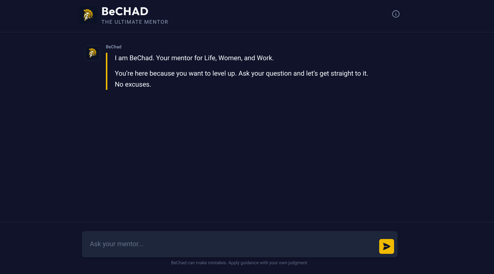

# BeChad — AI Mentor for Men

**A RAG-powered AI chatbot that delivers actionable guidance on Life, Women, and Work.**

[](https://developer.mozilla.org/en-US/docs/Web/JavaScript)
[](https://workers.cloudflare.com)
[](https://openai.com)
[](https://supabase.com)
[](https://tailwindcss.com)
[](LICENSE)

## Overview

<p align="center">
  
</p>

BeChad is a conversational AI assistant built on **Retrieval-Augmented Generation (RAG)** architecture. It retrieves relevant passages from a curated knowledge base using vector similarity search, then generates contextual, mentor-style responses using OpenAI's language models.

The system is designed with a clear separation between a **static frontend** (HTML + Tailwind CSS v4 + Vanilla JS) and a **serverless backend** (Cloudflare Worker), communicating via a single REST API endpoint.

> **📖 Note**: BeChad's knowledge is sourced from _The Way of the Superior Man_ by David Deida. Responses reflect the book's philosophy and should be taken as perspective, not absolute truth.

## Key Features

### Core RAG Architecture

- **Semantic Search**: Vector-based retrieval using Supabase pgvector for precise context matching
- **Knowledge Base Integration**: 146-page PDF chunked into embeddings for efficient retrieval
- **Intelligent Generation**: Context-aware responses using OpenAI `gpt-4o-mini`
- **Conversational Memory**: Last 10 messages maintained for coherent multi-turn conversations

### Chat Interface

- **Premium Dark UI**: Obsidian & gold design with glassmorphism, custom scrollbars, and smooth animations
- **Markdown Rendering**: Bot responses rendered with proper formatting (bold, lists, headings) via `marked.js`
- **Fully Responsive**: Optimized for both mobile and desktop viewports
- **Auto-Scroll**: Debounced `MutationObserver` for reliable scroll behavior on fast responses

### Security & Performance

- **CORS Locked**: Origin-restricted API access via configurable `ALLOWED_ORIGIN`
- **Input Validation**: 500-character query limit, server-side history sanitization
- **Tuned Retrieval**: Similarity threshold of 0.6 with top-3 chunk retrieval for lean, relevant context
- **Edge Deployment**: Cloudflare Workers for low-latency serverless execution

## Technical Architecture

### RAG Pipeline

```text
User Query → Embedding → Vector Search → Context Retrieval → Prompt Building → LLM Generation → Response
     ↓            ↓            ↓               ↓                  ↓                ↓              ↓
 "How do I     OpenAI      Supabase        Top-3 most        System prompt     gpt-4o-mini     Mentor-style
  find my    text-embed   pgvector DB      relevant          + context +        (temp 0.7)      actionable
  purpose?"  -3-small     cosine sim.      chunks            history + query                    advice
```

### Stack

| Layer      | Technology                         | Purpose                               |
| ---------- | ---------------------------------- | ------------------------------------- |
| Frontend   | HTML5, Tailwind CSS v4, Vanilla JS | Chat interface                        |
| Backend    | Cloudflare Workers (JS)            | Serverless API                        |
| Embeddings | OpenAI `text-embedding-3-small`    | Text → 1536-dim vectors               |
| LLM        | OpenAI `gpt-4o-mini`               | Response generation                   |
| Vector DB  | Supabase + pgvector                | Embedding storage & similarity search |
| Ingestion  | LangChain.js, Node.js              | Document chunking & embedding         |

## Project Structure

```text
BeChad/
├── frontend/                      # Static chat UI
│   ├── index.html                 # Main HTML page
│   ├── app.js                     # Chat logic & API calls
│   ├── style.css                  # Custom styles (scrollbar, markdown)
│   └── assets/
│       └── logo.png               # BeChad branding
│
├── backend/                       # Cloudflare Worker API
│   ├── src/
│   │   ├── index.js               # Worker entry point & router
│   │   ├── embedding.js           # OpenAI embedding helper
│   │   ├── retrieval.js           # Supabase similarity search
│   │   ├── generation.js          # OpenAI chat completion
│   │   └── prompt.js              # System prompt & template
│   ├── wrangler.toml              # Cloudflare Worker config
│   └── package.json
│
├── scripts/                       # Offline ingestion pipeline
│   ├── ingest.js                  # PDF → chunks → embeddings → Supabase
│   ├── test-retrieval.js          # Retrieval verification script
│   └── package.json
│
├── data/                          # Source document
│   └── The Way Of The Superior Man.pdf
│
├── docs/                          # Documentation
│   ├── SRS.md                     # Software Requirements Specification
│   ├── DESIGN_SYSTEM.md           # Visual identity & UI guidelines
│   ├── tasks.md                   # Project phase tracker
│   └── issue.md                   # Known issues & fixes
│
├── .env.example                   # Environment variable template
└── .gitignore
```

## Installation & Setup

### Prerequisites

- **Node.js** 18+ and npm
- **Wrangler CLI** (installed as dev dependency)
- **OpenAI API** account with API key
- **Supabase** project with pgvector extension enabled

### 1. Clone the Repository

```bash
git clone https://github.com/mibienpanjoe/BeChad.git
cd BeChad
```

### 2. Set Up Environment Variables

Copy the example env and fill in your credentials:

```bash
cp .env.example .env
```

```env
OPENAI_API_KEY=your_openai_api_key
SUPABASE_URL=https://your-project.supabase.co
SUPABASE_SERVICE_KEY=your_supabase_service_role_key
SUPABASE_ANON_KEY=your_supabase_anon_key
```

### 3. Set Up the Database

In your Supabase SQL editor, enable pgvector and create the required table and function:

```sql
-- Enable pgvector
CREATE EXTENSION IF NOT EXISTS vector;

-- Create documents table
CREATE TABLE documents (
  id UUID PRIMARY KEY DEFAULT gen_random_uuid(),
  content TEXT,
  embedding VECTOR(1536),
  metadata JSONB
);

-- Create similarity search function
CREATE OR REPLACE FUNCTION match_documents (
  query_embedding VECTOR(1536),
  match_threshold FLOAT DEFAULT 0.7,
  match_count INT DEFAULT 5
)
RETURNS TABLE (id UUID, content TEXT, metadata JSONB, similarity FLOAT)
LANGUAGE plpgsql AS $$
BEGIN
  RETURN QUERY
  SELECT documents.id, documents.content, documents.metadata,
    1 - (documents.embedding <=> query_embedding) AS similarity
  FROM documents
  WHERE 1 - (documents.embedding <=> query_embedding) > match_threshold
  ORDER BY similarity DESC
  LIMIT match_count;
END;
$$;
```

### 4. Ingest the Knowledge Base

```bash
cd scripts
npm install
npm run ingest
```

Verify with a test query:

```bash
npm run test-retrieval
```

### 5. Run the Backend

```bash
cd backend
npm install
```

Create a `.dev.vars` file for local secrets:

```env
OPENAI_API_KEY=your_openai_api_key
SUPABASE_URL=https://your-project.supabase.co
SUPABASE_ANON_KEY=your_supabase_anon_key
ALLOWED_ORIGIN=http://localhost:3000
```

Start the dev server:

```bash
npm run dev
```

The API will be available at `http://localhost:8787`.

### 6. Run the Frontend

```bash
cd frontend
npx serve .
```

Open `http://localhost:3000` in your browser.

## API Reference

### `POST /api/chat`

**Request:**

```json
{
  "query": "How do I find my purpose ?",
  "history": [
    { "role": "user", "content": "previous question" },
    { "role": "assistant", "content": "previous answer" }
  ]
}
```

**Response (200):**

```json
{
  "response": "Discipline at work starts with..."
}
```

**Constraints:**

- `query`: Required, max 500 characters
- `history`: Optional, last 10 messages kept server-side

## Acknowledgments

### Technology

- **[OpenAI](https://openai.com)** — Embedding and language model APIs
- **[Supabase](https://supabase.com)** — Postgres database with pgvector extension
- **[Cloudflare Workers](https://workers.cloudflare.com)** — Edge serverless runtime
- **[LangChain.js](https://js.langchain.com)** — Document loading and text splitting
- **[Tailwind CSS](https://tailwindcss.com)** — Utility-first CSS framework

### Knowledge Source

- _The Way of the Superior Man_ by **David Deida** — The foundational text powering BeChad's guidance

---

**⚡ Built with RAG architecture for contextual, grounded mentorship — not generic AI advice.**
